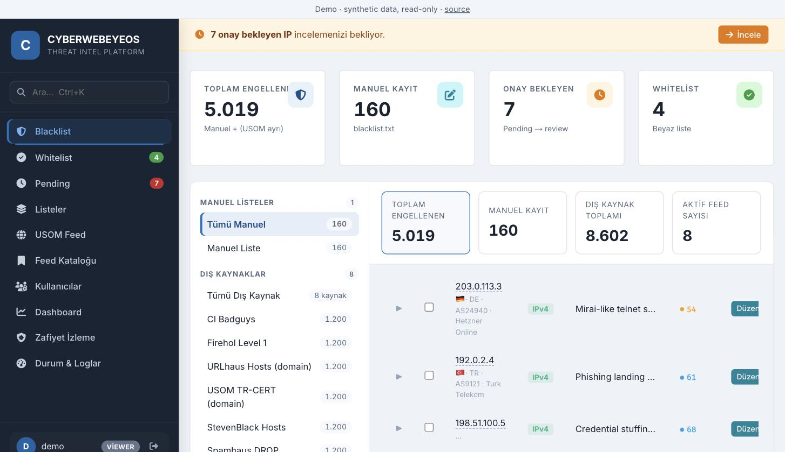
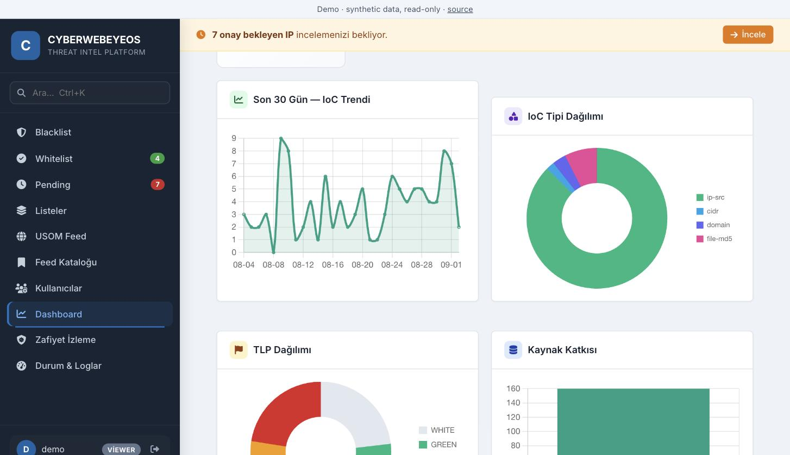
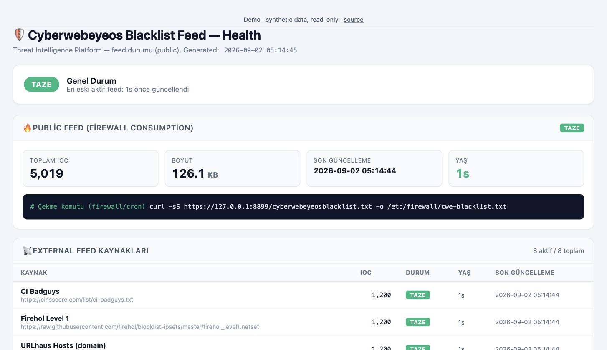
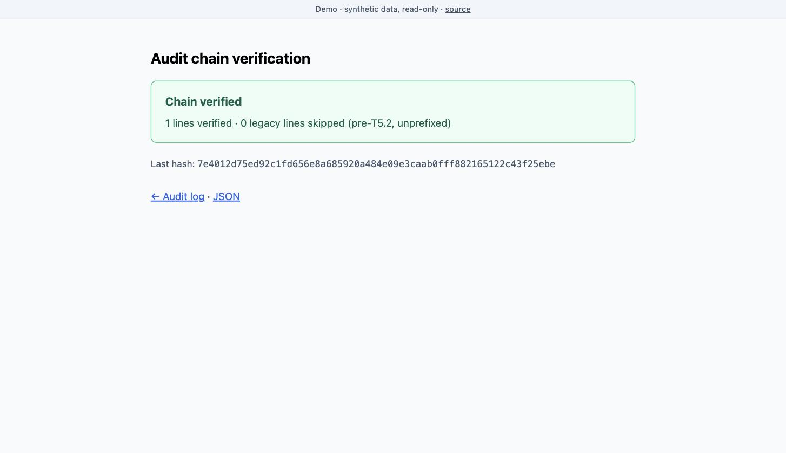

# BlockHarbor — Tehdit İstihbaratı Platformu

*[English](README.en.md)*

BlockHarbor, public tehdit istihbaratı beslemeleriyle bu beslemelere göre aksiyon
alması gereken ağ cihazları arasında duran, kendi sunucunuzda çalışan bir
platformdur. Dış kaynaklardan IoC toplar, warninglist'lere karşı yanlış
pozitifleri azaltır, göstergeleri üçüncü taraf itibar verisiyle zenginleştirir ve
sonucu güvenlik duvarının tüketebileceği bir blocklist, bir TAXII 2.1 koleksiyonu
ve bir REST API olarak yeniden yayımlar.

Var olma sebebi şu: bir blocklist'in işe yarayan kısmı nadiren ham beslemenin
kendisidir. Beslemenin tekilleştirilmesi, whitelist'ten çıkarılması, güvenlik
duvarının gerçekten tutabileceği CIDR bloklarına toplanması, hangi kaynağın
bildirdiğine kadar izlenebilmesi ve biri bir kaydı sildiğinde bunun
denetlenebilmesi gerekir. BlockHarbor bu işi yapar ve yaptığının doğrulanabilir
bir kaydını tutar.

## Özellikler

**Dağıtım**
- **TAXII 2.1 sunucusu** — discovery, api-root, collection ve object uçları;
  IoC'ler STIX 2.1 `indicator` nesneleri olarak sunulur (`taxii.php`)
- **REST API** — `X-API-Key` başlığı arkasında `stats`, `iocs`, `search`,
  `export`, `add`, `audit` aksiyonları; anahtar başına rol (`api.php`)
- **Firewall beslemesi** — etkin tüm kaynaklardan yeniden üretilen, whitelist
  çıkarılmış, atomik yazılan düz blocklist; güvenlik duvarı doğrudan çeker
  (`lib_firewall_feed.php`)

**Toplama**
- **8 dış besleme** — Spamhaus DROP/EDROP, Firehol Level 1, CI Badguys, URLhaus,
  StevenBlack, MalwareBazaar, USOM (TR-CERT) — kaynak bazlı sağlık takibiyle
- **CSAF 2.0 çekici** ve **üretici PSIRT RSS** — Cisco, Red Hat, Palo Alto ve
  diğerleri; yapılandırılabilir üretici listesi ve CVSS eşiğiyle filtrelenir
- **ThreatFox** IoC alımı ve SIEM'den gözlem göndermek için **sightings API**

**Analiz**
- **Zenginleştirme** — VirusTotal v3, GreyNoise Community, Shodan InternetDB ve
  ipgeolocation.io; her biri ücretsiz kota sınırları içinde kalmak için diskte
  TTL'li önbellekle
- **IoC pivot** — bir göstergeyi CVE'ler, müşteri varlıkları ve Shodan maruziyet
  verisiyle çapraz eşler
- **Provenance** — her gösterge hangi kaynağın bildirdiğini, ilk ve son ne zaman
  görüldüğünü, kaç kaynağın hemfikir olduğunu saklar
- **CIDR agregasyonu** — dağınık tekil IP'leri, yapılandırılabilir bir eşik
  aşıldığında `/24` bloklara toplar; kuru koşum modu ve otomatik yedekle
- **Warninglist'ler** — RFC 1918, IANA rezerve, public DNS çözücüler ve Tranco
  top-10k, bir gösterge kabul edilmeden önce kontrol edilir; bariz yanlış
  pozitifler bastırılır

**Operasyon**
- **Doğrulanabilir denetim kaydı** — her kayıt `sha256(önceki_hash + "|" + json)`
  biçiminde, sabit bir genesis'ten başlayan bir hash zinciri oluşturur.
  `verify_audit.php` logun ortasındaki her müdahaleyi veya silmeyi tespit eder
- **RBAC** — `admin` / `operator` / `viewer` rolleri, sadece arayüzde değil,
  durum değiştiren her uçta sunucu tarafında zorunlu tutulur
- **Bildirimler** — blacklist, whitelist, kullanıcı ve besleme olaylarında
  e-posta ve webhook
- **Yanlış pozitif raporlama** ve kaynak bazlı besleme sağlığı panelleri

## Mimari

```
                          DIŞ KAYNAKLAR
   Spamhaus · Firehol · URLhaus · USOM · MalwareBazaar · StevenBlack
   ThreatFox · NVD/KEV · Üretici PSIRT (RSS) · CSAF 2.0 bültenleri
                               │
                               ▼
   ┌───────────────────────────────────────────────────────────────┐
   │  TOPLAMA           sources_manager · csaf_fetcher              │
   │                    psirt_rss_fetcher · cve_fetch · threatfox   │
   │                    api.php (ingest) · sighting.php (SIEM)      │
   └───────────────────────────────┬───────────────────────────────┘
                                   ▼
   ┌───────────────────────────────────────────────────────────────┐
   │  NORMALLEŞTİRME & FİLTRELEME                                  │
   │    warninglist  →  RFC1918 · IANA rezerve · public DNS         │
   │                    Tranco top-10k                              │
   │    whitelist çıkarma · tekilleştirme · TTL sona erme           │
   └───────────────────────────────┬───────────────────────────────┘
                                   ▼
   ┌───────────────────────────────────────────────────────────────┐
   │  SAKLAMA         blacklist.txt · lists_dyn/ · lists.json       │
   │                  blacklist_meta.json  ← IoC başına provenance  │
   └───────────────────────────────┬───────────────────────────────┘
                                   ▼
   ┌───────────────────────────────────────────────────────────────┐
   │  ZENGİNLEŞTİRME & ANALİZ                                      │
   │    VirusTotal · GreyNoise · Shodan · ipgeolocation (önbellekli)│
   │    ioc_pivot · ioc_provenance · ioc_history                    │
   │    cidr_aggregate · fp_report · feed_health                    │
   └───────────────────────────────┬───────────────────────────────┘
                                   ▼
   ┌───────────────────────────────────────────────────────────────┐
   │  DAĞITIM                                                      │
   │    taxii.php        →  TAXII 2.1 / STIX 2.1  →  TIP, MISP      │
   │    api.php          →  REST + X-API-Key      →  SOAR, script   │
   │    firewall feed    →  düz blocklist         →  FortiGate,     │
   │                                                 pfSense, F5    │
   └───────────────────────────────────────────────────────────────┘

   KESİŞEN BİLEŞENLER
     blacklist_admin_auth.php  →  RBAC (admin / operator / viewer)
     audit_log.php             →  sha256 ile zincirlenmiş denetim kaydı
     lib_safe_write.php        →  atomik yazma (tmp + rename)
     notify.php                →  e-posta / webhook olayları
```

**Yığın:** PHP 8.5, PostgreSQL (kimlik doğrulama ve denetim
`archive/blockharbor-modern` dalında), Apache, Docker. Framework yok — kurulum
yüzeyi denetlenebilir kalsın diye bilinçli bir tercih.

## Ekran görüntüleri

[Canlı demodan](https://altanmelihhh-web.github.io/BlockHarbor/) alınmıştır;
veriler sentetiktir.

**Blocklist** — canlı sayılarla liste kenar çubuğu, ülke/ASN/güven skoruyla
zenginleştirilmiş göstergeler, TLP etiketleme ve provenance için satır içi açılım.



**Dashboard** — 30 günlük alım trendi, gösterge tipi ve TLP dağılımı, kaynak
bazlı katkı.



**Besleme sağlığı** — kaynak bazlı çekme durumu, çıkarılan kayıt sayısı, yaş ve
bir güvenlik duvarının yayımlanan beslemeye karşı kullanacağı çekme komutu.



**Denetim zinciri doğrulama** — tüm log üzerinde
`sha256(önceki_hash + "|" + json)` zincirini yeniden hesaplar ve varsa ilk
kırılmayı raporlar. İzleme için JSON, betikler için CLI çıkış kodu olarak da
kullanılabilir.



## Canlı demo

**[altanmelihhh-web.github.io/BlockHarbor](https://altanmelihhh-web.github.io/BlockHarbor/)** · [ayna](https://altanmelihhh-web.github.io/blockharbor-demo/)

| | |
|---|---|
| Veri | sentetik — yalnızca RFC 5737 adresleri, atanmamış CVE numaraları |
| Yazma | devre dışı |
| Arka uç | yok — aşağıya bakın |

Yayındaki demo statik bir anlık görüntüdür. `bin/build-static-demo.sh` gerçek
uygulamayı demo modunda ayağa kaldırır, salt-okunur sayfaları ve arayüzün
istediği tüm JSON yanıtlarını yakalar, sonra `fetch()` çağrılarını bu yakalanmış
yanıtlara yönlendiren bir katman enjekte eder. Bir GitHub Actions iş akışı
`main`'e her push'ta yeniden üretir; böylece anlık görüntü koddan sapamaz.

Bu bilinçli bir tercih: anlık görüntü anında açılır ve ayakta kalır; ücretsiz bir
konteyner ise ilk ziyarette yaklaşık bir dakika soğuk başlangıç yapardı.
Gezinme, zenginleştirme, provenance, pivot ve zincir doğrulama gerçek yakalanmış
çıktıyı gösterir; yakalanmamış bir sorgu bunu açıkça söyler.

Tam dinamik uygulamayı çalıştırmak isteyenler için `render.yaml` da dahildir —
Render blueprint, ücretsiz plan, `demo` / `demo`.

Demo modu `DEMO_MODE=true` ile açılır ve PHP'nin her isteğin önüne
`auto_prepend_file` ile yüklediği `demo_mode.php` tarafından uygulanır. Bunun uç
bazlı değil giriş kapısında yapılması bilinçlidir: bu kod tabanındaki birkaç
betik kendi kimlik doğrulaması olmadan gelir, dolayısıyla hiçbir şeyin
atlanmadığından emin olmanın tek yolu giriş noktasındaki bir kapıdır.

Bayrağın değiştirdikleri:

- **Salt okunur.** `GET`/`HEAD` dışındaki her şey reddedilir; istisna giriş ve
  çıkış formlarıdır. `GET` ile durum değiştiren betikler — migrasyonlar, besleme
  çekiciler, kullanıcı yönetimi — doğrudan reddedilir.
- **Admin hesabı yok.** `login.php` yalnızca `demo`/`demo`'yu viewer olarak kabul
  eder; `auth_config.php` ise `admin`/`admin` yedeği yerine kullanılamaz rastgele
  bir hash üretir, yani varsayılan kimlik bilgileri çalışamaz.
- **Dışarıya çağrı yok.** VirusTotal, GreyNoise, Shodan ve coğrafi konum
  sağlayıcısı deterministik sahte yanıt döner; konteynerden hiçbir şey çıkmaz.
- **Zamanlanmış iş yok.** Besleme çekme cron'u kurulmaz.
- **Her HTML sayfada bir bant.** JSON ve TAXII yanıtlarına dokunulmaz.
- **Her açılışta taze veri seti**, `bin/seed-demo.php` tarafından üretilir.

Mount noktası `CWE_BASE_PATH` ile yapılandırılabilir — demo için `/`, mevcut
kurulumlar için varsayılan olarak eski `/blacklist/cyberwebeyeos` yolu.

Yerelde çalıştırmak için:

```bash
DEMO_MODE=true CWE_BASE_PATH=/ docker compose up --build
```

---

## Hızlı başlangıç

### Adım 1 — Docker kurulumu (kurulu değilse)

```bash
# Ubuntu / Debian
sudo apt install docker.io docker-compose-v2 -y
sudo systemctl enable --now docker
```

### Adım 2 — Çalıştırma

```bash
git clone https://github.com/altanmelihhh-web/BlockHarbor.git
cd BlockHarbor
bash bin/docker-up.sh
```

Betik şunları yapar:
- `.env` dosyasını `.env.example`'dan otomatik oluşturur
- Çalışma zamanı durumunu (`users.json`, `whitelist.txt`, ...) ilk açılışta
  paketle gelen `*.example` şablonlarından üretir
- Port çakışmalarını tespit eder ve gerekirse farklı bir port sorar
- İmajı derler ve konteyneri başlatır

Erişim: **http://localhost:8090/blacklist/cyberwebeyeos/**

Varsayılan giriş: `admin` / `admin` — ilk girişten hemen sonra parolanızı
değiştirin.

> **Etkileşimsiz / CI:** `bash bin/docker-up.sh --auto-port` (soru sormaz, ilk
> boş portu kendi seçer)

---

## Yapılandırma

`.env.example` dosyasını `.env` olarak kopyalayıp şunları ayarlayın:

| Değişken | Açıklama |
|---|---|
| `HTTP_PORT` | Host portu (varsayılan: 8090) |
| `CWE_ADMIN_USERNAME` | Admin kullanıcı adı (varsayılan: admin) |
| `CWE_ADMIN_PASSWORD_HASH` | Admin parolasının bcrypt hash'i |
| `CWE_BASE_PATH` | Uygulamanın sunulduğu yol (varsayılan: `/blacklist/cyberwebeyeos`) |
| `CWE_VT_API_KEY` | VirusTotal v3 API anahtarı (opsiyonel) |
| `CWE_GREYNOISE_API_KEY` | GreyNoise community anahtarı (opsiyonel, 50/gün) |
| `CWE_IPGEOLOCATION_API_KEY` | ipgeolocation.io anahtarı (opsiyonel) |
| `CWE_API_KEYS` | REST API anahtarlarının JSON dizisi (opsiyonel) |
| `CWE_USOM_BASE` | Ayrı USOM senkronizasyon servisinin yolu (opsiyonel) |
| `DEMO_MODE` | Salt-okunur public demo modu (varsayılan: `false`) |

### Çalışma zamanı durum dosyaları

Bu dosyalar kimlik bilgisi ve operasyonel veri tutar; bu yüzden
**gitignore'dadır** ve depoyla yalnızca şablonları gelir. Tek komut hem bunları
hem de uygulamanın yazdığı ama kendisi oluşturmadığı dosya ve dizinleri kurar:

```bash
sh bin/init-state.sh
```

Docker entrypoint'i de aynı betiği çalıştırır, böylece konteyner ve çıplak
kurulum birebir aynı şekilde başlar. Betik idempotenttir — var olan dosyalara
dokunmaz.

Bu dosyaları asla geri commit etmeyin; `.gitignore` içinde bilinçli olarak hariç
tutulmuşlardır.

Parola hash'i üretmek için:
```bash
docker compose exec app php -r "echo password_hash('parolaniz', PASSWORD_BCRYPT) . PHP_EOL;"
```

## Veri kalıcılığı

Tüm çalışma zamanı verisi (beslemeler, blacklist, durum dosyaları) `cwe_data`
adlı Docker volume'ünde saklanır ve konteyner yeniden başlatmalarında korunur.

Tüm veriyi sıfırlamak için:
```bash
docker compose down -v
bash bin/docker-up.sh
```

## Zamanlanmış işler (cron)

Besleme çekme ve CVE senkronizasyonu `cron/cyberwebeyeos-tip` içinde tanımlıdır.
Host üzerine kurmak için:

```bash
sudo cp cron/cyberwebeyeos-tip /etc/cron.d/cyberwebeyeos-tip
sudo systemctl reload cron
```

## REST API

`X-API-Key: <anahtar>` başlığı gönderin. Anahtarlar `CWE_API_KEYS` ortam
değişkeniyle yapılandırılır.

```bash
curl -H "X-API-Key: anahtariniz" http://localhost:8090/blacklist/cyberwebeyeos/api.php?action=list
```

## TAXII 2.1

Discovery ucu: `GET /blacklist/cyberwebeyeos/taxii2/`

## Üretim notları

- TLS'i sonlandıran bir ters vekil (nginx/caddy) arkasında çalıştırın
- Dış istemcilere açmadan önce `CWE_API_KEYS` anahtarlarını değiştirin
- `.env` içinde `CWE_ADMIN_PASSWORD_HASH` değerini güçlü bir bcrypt hash'i yapın
- Public bir adreste `DEMO_MODE` değerini asla `false` bırakmayın

## Lisans

MIT — bkz. [LICENSE](LICENSE).
